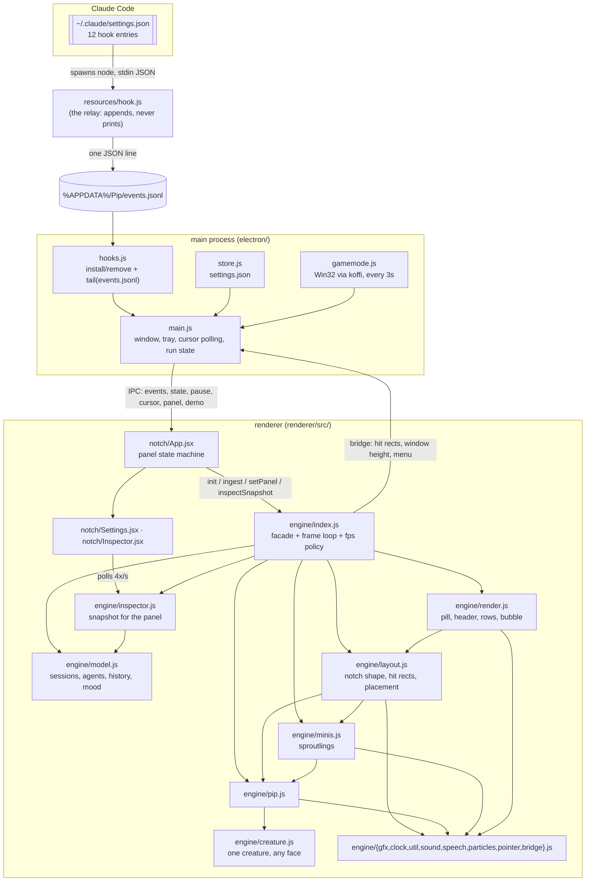

# Pip — map for future sessions

A Windows Electron app: a notch at the top of the screen with a little mint sprout
(Pip) in it that follows your Claude Code sessions. Every subagent pops out as a
coloured sproutling. Click a sproutling (or a row) to see what it is doing, live.
Everything visual is drawn on one canvas, in code: no images, no UI framework for
the creature. React only draws the two panels.

```
npm start      # vite build + electron .   (run it from source)
npm run smoke  # headless engine test, ~30 checks, no window   <- run this after engine changes
npm run icon   # re-render build/icon.png from the engine
npm run dist   # installer -> release/Pip-Setup-<version>.exe (then prunes older ones)
npm run prune  # keep only the current version's installer in release/
PIP_DEV=1      # load the renderer from the vite dev server (npm run dev first)
PIP_DEBUG=1    # expose window.__pip = { engine, openPanel, closePanel } to DevTools
```

## The graph

Two processes. The main process owns the window and the outside world; the
renderer owns everything you see. Arrows are "depends on / sends to"; nothing
points back up.



Import layers inside `renderer/src/engine/` — **imports only ever point down**,
which is what keeps this graph a DAG and the modules testable:

```
 0  util  gfx  clock  bridge  sound  speech  pointer      (no engine imports)
 1  particles  creature  model                            (-> layer 0)
 2  pip                                                   (-> model, creature, …)
 3  minis  inspector                                      (-> pip, model)
 4  layout                                                (-> minis, pip, model, bridge)
 5  render  input                                         (-> layout, …)
 6  index  demo                                           (-> everything)
```

The two deliberate inversions, both so lower layers never reach upwards:

- **`model.setReactions({ onSpawn, onFinish, onMood })`** — the model is data only.
  The fanfare (sound, particles, "go little buddy!") lives in `pip.js`/`minis.js`
  and is wired in `index.js:init`.
- **`bridge.js`** — the engine never imports Electron or React. `host.*` goes to
  the main process, `ui.*` to React.

`gfx.js` exports `ctx` as a **live binding**: modules `import { ctx }` once and
see whatever canvas is attached (`attach` for the notch, `attachSquare` for the
build-time icon). Do not pass `ctx` around, and do not cache it in a local.

## The event pipeline

```
Claude Code event
  -> resources/hook.js            summarises to one compact line: {t,ev,sid,cwd,tool,tuid,detail,msg,ntype,res,aid,atype,bg}
  -> events.jsonl                 appended; trimmed to 300 lines past 512 KB
  -> electron/hooks.js createTail  pump() returns whole lines since the last offset
  -> main.js, every 200 ms        send("events", { events, replay })
  -> engine index.ingest          model.apply(e, replay) per event
  -> model                        sessions / agents / per-item activity log
  -> refreshMood() each frame     mood + lead session  -> everything visual
```

`replay: true` means *catching up quietly* (startup, or coming back from game
mode): same state changes, no sounds, no confetti, events older than 30 min
dropped. Every new code path must honour it.

`hook.js` rules, in order of importance: **never print to stdout** (a hook that
prints can answer a permission prompt), never fail, never take long. It is copied
to `%APPDATA%\Pip\hook.js` on every start (`hooks.ensureHookFile`), so changing it
needs no reinstall — but adding a field means old lines lack it: treat every
field as optional when reading.

## State machines

**Session state** (`model.js`), highest priority wins and becomes Pip's mood:

```
approval 6 > error 5 > working 4 > thinking 3 > finished 2 > idle 1 > sleeping 0
```

```
SessionStart        -> idle
UserPromptSubmit    -> thinking
PreToolUse          -> working   (+ spawn a sproutling for Agent/Task)
PostToolUse(Failure)-> thinking
PermissionRequest   -> approval  (also Notification with ntype=permission_prompt)
Stop                -> finished  (-> idle after 45 s)
StopFailure         -> error     (-> idle after 3 min)
SessionEnd          -> dropped   (kept in history for the inspector)
no session + 3 min quiet        -> sleeping
thinking/working stuck 10 min   -> idle
anything untouched for 30 min   -> dropped
```

**Agent lifecycle.** A sproutling is created by the `Agent`/`Task` PreToolUse
(key `tu:<tool_use_id>`), then *adopted* by the following `SubagentStart` so that
later events, which carry only `aid`, find it. Background agents (`bg`) outlive
their tool call; everything else finishes on `PostToolUse`, `SubagentStop` or
`Stop`. `finish()` → 1.4 s of "done ✓" → puff → `retire()` → moved to
`model.history` (last 24), which is why the inspector can still show an agent
that has just vanished from the notch.

## The frame loop

`clock.js` owns scheduling; `index.js` owns the policy. As slow as still looks
right, never faster:

| fps | when |
| --- | --- |
| 60 | a recent `wake()`, jumps/spins/shake, the notch resizing, Pip leaping, the cursor moving, confetti, sproutlings settling |
| 30 | ambient only: particles (sleepy z's excluded), speech bubble, an emote, whistling |
| 24 | Claude is thinking/working/needs you, or any agent exists |
| 12 | idle |
| 6 | napping |
| 0 | paused (game mode): no timers, no rAF, particles and bubble cleared |

Two more CPU rules, both easy to break by accident:

- **The window is resized to what is drawn** (`fitWindow`, 32 px steps, grows at
  once and shrinks after 0.8 s): a transparent window costs CPU per pixel per
  frame. Anything new that draws below the notch must be in that calculation
  (`minis.lowest`, `particles.lowest`).
- **Only the solid parts take clicks** (`layout.publishHitRects` → `setHitRects`).
  Everything else is click-through, so Pip never swallows a click meant for the
  app behind it. The notch is one rect; anything outside it that must stay
  clickable (a leaping Pip, a sproutling in the playground) gets its own small
  rect, snapped to 16 px so a moving target doesn't send IPC every frame. The
  cursor is polled by the *main* process (`cursorTick`), which is why Pip keeps
  looking at you even when the window ignores the mouse.

## Where the sproutlings go

`layout.placeMinis` picks one of four arrangements each frame, and `minis.js`
animates towards it:

| when | where |
| --- | --- |
| a panel is open | parked in a line on the panel's bottom edge |
| the notch is open | one per row, standing by its own line |
| 2+ helpers, notch closed | **the playground**: `minis.roam` picks a spot under the notch every 1.4–3.8 s, on looser springs (k 52 vs 110), with the odd hop; they look where they are walking |
| otherwise | in a row inside the pill, beside the text |

The playground latches on at two helpers and only lets go when the last one
finishes (`PLAY_FROM`, and the `playing` flag in `layout.js`), so one of them
ending doesn't yank the rest back inside. While it is on, the pill stops
reserving width for them and the "+n" badge is hidden — they are all on screen.

## Clicks

| target | what happens | where |
| --- | --- | --- |
| Pip | tickle; 5 pokes → dizzy; wakes it from a nap | `pip.poke` |
| a sproutling | open the inspector on that subagent, click again to close | `input.js` → `inspector.toggle` → `ui.onInspect` → `App.openPanel("inspect")` |
| a row (notch open) | same, for that session or agent | `layout.rowAt` / `rowTarget` |
| the pill | pin the notch open | `layout.togglePinned` |
| right click | native menu from the main process | `bridge.host.menu` |
| gear, tray, 2nd instance | Settings | `send("panel", …)` |
| tray → Activity | inspector on the busiest session | `engine.inspectLead` |

The inspector panel **must not take focus** (`pip.setFocus(name === "settings")`):
the whole point is reading it while your terminal stays active. Settings takes
focus only because it has a text field.

## Panels

A panel is React DOM inside the notch, not a second window. `App.jsx` holds
`panel: null | "settings" | "inspect"`, tells the engine its size
(`engine.setPanel`), and the engine grows the notch to match and parks the
sproutlings on the panel's bottom edge. `Inspector.jsx` keeps no state of its
own: it polls `engine.inspectSnapshot()` every 250 ms, so the panel can never go
stale and the engine stays the single source of truth.

**Nothing in the inspector scrolls.** It measures itself after every paint and
calls `engine.resizePanel(height)`, so the notch grows to the content instead
(clamped to 180–540 px); the log shows the last 8 entries and counts the rest as
"+n earlier". If you add anything to that panel, keep it inside that budget
rather than reaching for `overflow: auto`.

## When you change something

- **Engine change** → `npm run smoke`. It stubs the canvas, the clock
  (`performance.now` *and* `Date.now`, so aging and napping are testable) and the
  audio context, then feeds a whole session, clicks a sproutling, opens the
  inspector, pauses, replays, and runs the demo — ~30 checks, no window.
- **Anything visual** → `npm start`, then Settings → **Demo**: a scripted tour of
  every state with three sproutlings (`engine/demo.js`).
- **New hook field** → add it in `resources/hook.js` *and* read it defensively.
- **New mood** → `MOODS` in `model.js` (accent + label + priority), a face in
  `pip.face`, and a reaction in `pip.onMood`.
- `W`/`H` in `engine/gfx.js` must stay in sync with `electron/main.js`.
- Keep `koffi` under `asarUnpack` in `package.json`, or game mode dies in the
  installed build.
