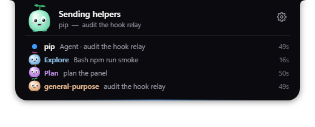
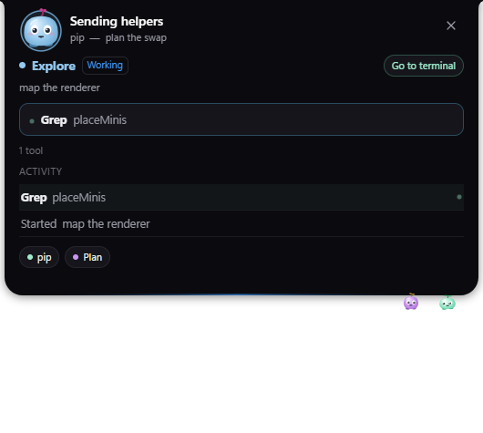
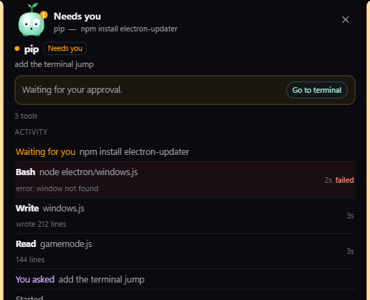

# Pip

[](https://github.com/aymengraoui/pip/actions/workflows/ci.yml)

A tiny companion that lives in a notch at the top of your screen and follows your Claude Code sessions and subagents.


When more than one helper is working they come out to play under the notch;
hovering opens the notch into a list, and clicking any of them says exactly what
it is doing.

| | |
| --- | --- |
|  |  |

When Claude needs you, Pip says what for and offers one click to the terminal
that is asking — the decision stays where you can read the whole command:




## Build & run

```
npm install
npm start          # build the UI and run from source
npm run smoke      # headless test of the engine (~30 checks, no window)
npm run dist       # installer → release/Pip-Setup-<version>.exe (electron-builder, NSIS, per-user)
                   # each build prunes older installers, so release/ only ever holds the current one
```

If `node_modules/electron/dist` is missing after install, run `node node_modules/electron/install.js`.

### Cutting a release

Bump `version` in `package.json`, rewrite `RELEASE_NOTES.md` (it becomes the
release body), then:

```
git commit -am "Pip 1.2.0" && git tag v1.2.0 && git push origin main v1.2.0
```

GitHub Actions builds the installer on Windows, runs the smoke test and
publishes the release with `latest.yml` and the `.blockmap` alongside it. Those
two files are what make updates automatic and downloads differential, so leave
them in the asset list. The tag has to match `package.json`; the workflow checks
and fails loudly if it doesn't.

Installed to `%LOCALAPPDATA%\Programs\pip\Pip.exe`. Data lives in `%APPDATA%\Pip` (`settings.json`, `hook.js`, `events.jsonl`).

## Using it

- **Hover** the notch for sessions and agents; click it to keep it open.
- **Click a sproutling** (or a row in the open notch) to see exactly what that
  subagent is doing: the tool it is running right now and for how long, its
  recent activity with durations, results and failures, and chips for everything
  else running so you can follow it instead. The panel is sized to its contents,
  so nothing scrolls, and it never takes focus, so your terminal stays active.
  Click the same sproutling again, or the ×, to close it. Also on the tray menu
  as **Activity**.
- **Review.** When Claude is waiting on you the notch says what for and shows a
  **Review →** button: one click and the terminal that is asking comes to the
  front, where you can read the whole command and answer it. It's on the tray
  menu too, and in the activity panel as **Go to terminal**. Pip never answers a
  prompt for you — it only takes you to it. Pip knows which process Claude Code is because the hook
  relay records its own parent, and it walks up from there to whatever window is
  hosting it — Windows Terminal, a VS Code shell, plain conhost. Windows doesn't
  always let a background app steal focus; when it refuses, Pip makes the
  taskbar button blink instead.
- **The playground**: with two or more helpers working, they leave the notch and
  amble around the strip of screen underneath it. Where they go is the work, not
  a dice roll: two helpers running the same tool drift together, a busy one moves
  more, one that just failed slumps and stays low for a few seconds, and
  background work keeps to the edges. Only they take clicks down there — the rest
  of that strip stays click-through — and they file back into the notch the
  moment you open it.
- **Pip says when something looks stuck.** It sits outside every session and
  keeps their logs, so it notices what you wouldn't while reading one terminal:
  the same command three times in a few minutes, a tool that has been running
  for over ten, or a session that went quiet with nothing in flight. The notch
  says so and the panel says which. No popups, and the thresholds are shy on
  purpose.
- **While you were away.** Pip knows when you haven't touched the keyboard for a
  few minutes. Come back and it tells you what you missed in one line — "2 turns
  finished, 1 failure" — and then shuts up.
- **Settings** live in the notch: the gear button (or the tray icon, or right-click Pip). Start with Windows, sounds, game mode, extra games, Claude Code hooks, demo, quit.
- **Subagents**: every agent Claude Code spawns pops out of Pip as a colored sproutling and poofs away when it finishes.
- **Updates** install themselves. Pip checks GitHub a minute after it starts and
  every six hours after that, downloads a new version in the background and then
  waits: it says it has grown, and puts **Restart now** in Settings and the tray.
  It never restarts on you, and it never checks at all while a game is running or
  Pip is paused. (Updating from 1.1.0 or older is still a manual download, since
  those builds shipped before any of this existed.)
- Click Pip to tickle, wiggle the mouse over it to pet, poke it five times for dizzy.

## What Pip keeps

Everything stays on your machine, in `%APPDATA%\Pip`:

- `events.jsonl` — one line per Claude Code hook event: the session, the working
  directory, the tool, a clipped description, and (unless you turn **Record tool
  results** off in Settings) a clipped line about how the call went, so the
  activity panel can show a failure without you opening the terminal. Capped at
  100 characters per result, 512 KB, and trimmed to the last 300 lines.
- `settings.json` and `hook.js`.

Nothing is sent anywhere. The only network request Pip ever makes is the update
check against this repo's GitHub releases, and that one stops while a game is
running.

## CPU

- **Game mode**: when a game (exclusive fullscreen, a Steam/Epic/Riot/Xbox/GOG/EA/Ubisoft/Battle.net install, or one of your extra games) or any fullscreen app is in front, Pip hides and stops animation, sound, cursor tracking and event tailing. Only a ~0.5 ms Win32 check runs every 3 s: Task Manager shows 0 %.
- **Otherwise**: adaptive frame rate (60 fps only for physics and interaction, 30 ambient, 24 while Claude works, 12 idle, 6 asleep) and a window resized to what's drawn, since a transparent window costs CPU per pixel per frame.

## Layout

- `electron/`: `main.js` (window, tray, cursor hit-testing, game mode loop), `gamemode.js` (Win32 via koffi), `hooks.js` (Claude Code hooks + event tail), `store.js` (settings).
- `renderer/src/engine/`: the canvas engine, in layers that only import downwards.
  `model.js` is what Claude Code is doing (sessions, agents, activity logs, mood);
  `pip.js`, `minis.js`, `creature.js`, `render.js` and `particles.js` draw it;
  `layout.js` decides the notch's shape and what takes clicks; `inspector.js`
  turns the model into the panel's live snapshot; `index.js` is the frame loop and
  the only thing React talks to.
- `renderer/src/notch/`: the window. `App.jsx` plus two panels, `Settings.jsx` and
  `Inspector.jsx`.
- `resources/hook.js`: the relay Claude Code runs on each hook event. It only appends to `events.jsonl` and never prints, so it can never answer a permission prompt.
- `CLAUDE.md`: the architecture graph, the event pipeline, the state machines and
  the rules worth not breaking.

Debug: `PIP_DEBUG=1` exposes `window.__pip` (engine, panels, `engine.frameStats()`) to DevTools.

## License

MIT, see [LICENSE](LICENSE).
